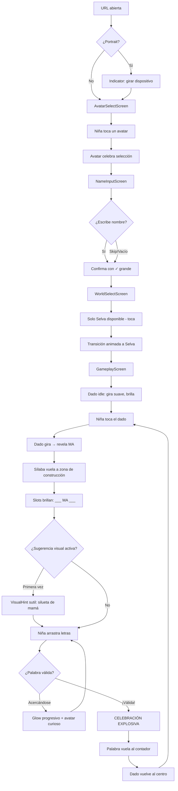
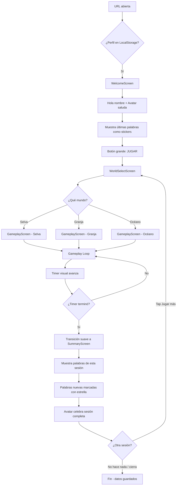
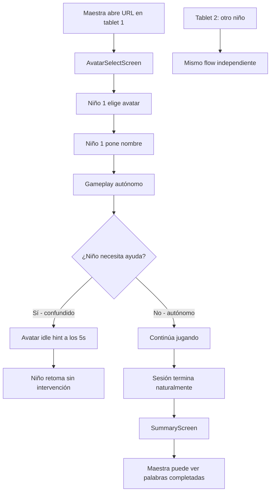

---
stepsCompleted:
  - step-01-init
  - step-02-discovery
  - step-03-core-experience
  - step-04-emotional-response
  - step-05-inspiration
  - step-06-design-system
  - step-07-defining-experience
  - step-08-visual-foundation
  - step-09-design-directions
  - step-10-user-journeys
  - step-11-component-strategy
  - step-12-ux-patterns
  - step-13-responsive-accessibility
  - step-14-complete
status: complete
completedAt: '2026-05-11'
inputDocuments:
  - '_bmad-output/planning-artifacts/prd.md'
  - '_bmad-output/planning-artifacts/product-brief-SILABC.md'
  - '_bmad-output/planning-artifacts/architecture.md'
  - '_bmad-output/planning-artifacts/prd-validation-report.md'
workflowType: 'ux-design'
---

# UX Design Specification — SILABC

**Autor:** LuisAgent
**Fecha:** 8 de mayo de 2026

---

<!-- UX design content will be appended sequentially through collaborative workflow steps -->

## Executive Summary

### Visión del Proyecto

SILABC es un juego web educativo para niños hispanohablantes de 4 a 6 años que enseña construcción de palabras mediante dados silábicos animados. La experiencia UX debe ser completamente autónoma para el niño: sin texto instructivo, sin configuración, sin posibilidad de error. El juego se comunica a través de animación, color, posición espacial y el vínculo emocional con un avatar animal compañero.

### Usuarios Objetivo

**Niños (4-6 años) — Usuario primario:**
- Pre-lectores o lectores emergentes
- Motricidad fina en desarrollo (dedos imprecisos, taps en vez de clicks)
- Atención sostenida de 3-7 minutos
- Responden a estímulos visuales animados, colores vivos y celebración
- No pueden leer instrucciones escritas
- Navegación por reconocimiento visual (iconos, colores, posición)

**Padres/tutores — Usuario secundario:**
- Necesitan zero fricción: el niño debe poder jugar sin ayuda
- Priorizan seguridad: sin links externos, sin datos, sin compras
- Valoran contenido educativo alineado con currículo preescolar

**Educadores — Usuario terciario:**
- Herramienta de apoyo sin curva de aprendizaje
- Debe funcionar en tablets compartidas (sin login = sin conflictos de sesión)

### Desafíos Clave de Diseño

1. **Interacción táctil para motricidad inmadura:** Drag & drop con zonas de snap generosas, tolerancia alta a imprecisión, feedback visual inmediato al contacto. Touch targets ≥ 48px, preferiblemente 56-64px para elementos de juego.
2. **Comunicación sin texto:** Toda instrucción, estado y feedback debe ser comprensible sin leer. Uso de iconografía, animación secuencial, posición espacial y color como lenguaje de la interfaz.
3. **Engagement sin frustración:** Diseñar el espectro completo de feedback (éxito, cercanía, exploración) sin que ningún estado se sienta como fracaso. Guías suaves que invitan sin obligar.
4. **Sesiones ultra-cortas:** Cada momento del juego debe ser inmediatamente gratificante. Zero pantallas de carga perceptibles, zero tiempos muertos, transiciones que entretienen.

### Oportunidades de Diseño

1. **Avatar como compañero emocional:** El avatar animal (mono, loro, rana) puede funcionar como guía no verbal — celebra éxitos, hace gestos suaves de ánimo, reacciona a las acciones del niño. Crea un vínculo afectivo que motiva el retorno.
2. **Mundos como universos inmersivos:** Cada mundo temático (Selva, Granja, Océano) es oportunidad de crear una identidad visual completa — paleta, fauna, ambientación, sonidos — que refuerza la progresión y el descubrimiento.
3. **Celebraciones como momento peak:** Las animaciones de éxito son el momento UX más importante. Confetti, avatar bailando, palabra que "cobra vida" — diseñar para deleitar, no solo confirmar.
4. **Dado silábico como objeto mágico:** El dado puede tener personalidad propia — gira, rebota, revela la sílaba con dramatismo. Es el ritual central del gameplay loop.

## Core User Experience

### Experiencia Definitoria

El gameplay loop de SILABC dura ~30 segundos y se repite indefinidamente dentro de una sesión de ~5 minutos:

1. **Lanzar** — El niño toca el dado. El dado gira con dramatismo (spring physics, rebote).
2. **Descubrir** — La sílaba se revela. El avatar reacciona con curiosidad.
3. **Construir** — La sílaba se ancla en la zona de construcción. El niño arrastra letras del alfabeto para completar una palabra.
4. **Validar** — El sistema da feedback en tiempo real: brillo suave cuando se acerca a una palabra, celebración explosiva cuando la completa.
5. **Celebrar** — Avatar baila, confetti, la palabra "cobra vida". Momento peak de la sesión.
6. **Repetir** — Nueva ronda automática. El dado invita a ser tocado de nuevo.

**Acción crítica a perfeccionar:** El drag & drop de letras. Es donde el niño pasa el 70% del tiempo. Debe sentirse como jugar con bloques físicos: las letras deben tener "peso" visual, snap magnético a la zona de construcción, y feedback táctil inmediato (scale up al tocar, sombra al arrastrar, snap satisfactorio al soltar).

### Estrategia de Plataforma

- **Web SPA horizontal** — Orientación landscape obligatoria (indicador amigable de rotación en portrait)
- **Touch-first** — Diseñado para dedos, funcional con mouse
- **Responsive:** 568px (móvil landscape) → 1920px (desktop)
- **Offline capaz** — Funciona completamente sin red una vez cargado
- **Sin instalación** — URL directa, zero friction de acceso
- **Tablets como dispositivo primario** — iPad, tablets Android de gama media-baja son el caso de uso más frecuente en contexto escolar

### Interacciones que Deben Ser Effortless

| Interacción | Objetivo UX |
|---|---|
| **Lanzar dado** | Un toque. Sin longpress, sin gesto complejo. Tap → animación → sílaba. |
| **Arrastrar letras** | Zona de pickup grande (≥56px). Snap magnético a zona de construcción desde 20px de distancia. |
| **Remover letra** | Tap en la letra colocada → vuelve al alfabeto con animación de retorno. |
| **Iniciar sesión** | Abrir URL → avatar familiar saluda → un tap para jugar. Máximo 2 taps de URL a gameplay para returning player. |
| **Cambiar mundo** | Visible desde gameplay. Un tap para volver a selección de mundo. |

### Momentos Críticos de Éxito

1. **Primer palabra completada (onboarding):** Si el niño forma su primera palabra en los primeros 60 segundos, el engagement se establece. El onboarding debe guiar sin ser explícito — la sílaba "MA" con sugerencia visual sutil de "MAMÁ" como primera experiencia.
2. **La celebración:** Este es el momento que el niño recordará. Debe ser tan gratificante que quiera repetirlo. Avatar saltando + confetti + palabra que crece y brilla + sonido festivo.
3. **El "casi":** Cuando el niño tiene "MAS" y la palabra es "MASA" — el feedback de proximidad (brillo suave, avatar expectante) debe motivar sin frustrar. Es la diferencia entre abandonar y descubrir.
4. **El retorno:** Cuando el niño vuelve y ve su avatar con su nombre y sus palabras anteriores — debe sentir que el juego lo recuerda y lo celebra.

### Principios de Experiencia

1. **Cero segundos muertos:** Cada momento tiene movimiento, color o invitación. Si el niño no hace nada por 5 segundos, el avatar hace un gesto suave de invitación, el dado se menea ligeramente.
2. **El error no existe:** No hay estado de fallo. Solo hay "explorando", "acercándose" y "¡lo logró!". Tres niveles de feedback positivo.
3. **Tactilidad digital:** Todo elemento interactivo se siente físico — tiene peso, rebota, encaja, snap. Las letras son bloques, el dado es un objeto con inercia, la zona de construcción es una bandeja.
4. **Celebrar > Instruir:** En caso de duda, celebrar más, instruir menos. La mecánica se enseña haciendo, no explicando.
5. **Autonomía total del niño:** El niño nunca necesita a un adulto. Ni para empezar, ni para jugar, ni para entender qué hacer.

## Desired Emotional Response

### Objetivos Emocionales Primarios

| Emoción | Descripción | Momento Clave |
|---|---|---|
| **Alegría desbordante** | El niño ríe, aplaude, quiere repetir. La celebración de palabra completada debe provocar una reacción física real. | Palabra validada → celebración |
| **Curiosidad activa** | "¿Qué sílaba saldrá?" / "¿Qué palabra puedo hacer?" El dado como caja de sorpresas. | Lanzamiento de dado |
| **Orgullo de logro** | "¡Yo hice eso!" El niño siente que descubrió la palabra por sí mismo, no que el sistema se la dio. | Validación + resumen de sesión |
| **Seguridad absoluta** | Nunca confusión, nunca miedo a equivocarse. El entorno es predecible, amable, siempre positivo. | Todo el flujo |
| **Pertenencia** | "Este juego me conoce, soy importante aquí." El avatar con su nombre y sus palabras. | Pantalla de bienvenida returning player |

### Mapa Emocional del Journey

```
URL → [Anticipación] → Avatar saluda → [Calidez/Pertenencia]
  → Selección de mundo → [Aventura/Curiosidad]
    → Lanzar dado → [Emoción/Suspense]
      → Sílaba revelada → [Curiosidad activa: "¿qué puedo hacer?"]
        → Arrastrar letras → [Concentración lúdica / Flow]
          → Proximidad → [Expectación: "¡casi!"]
            → ¡Palabra válida! → [ALEGRÍA EXPLOSIVA / Orgullo]
              → Nueva ronda → [Entusiasmo renovado]
  → Temporizador termina → [Satisfacción: "¡mira todo lo que hice!"]
    → Resumen → [Orgullo acumulado]
      → Cierre → [Deseo de volver]
```

### Micro-Emociones por Interacción

**Al tocar el dado:**
- Scale up sutil (1.05x) al contacto → sensación de control ("yo causé esto")
- Vibración visual durante giro → suspense ("¿qué saldrá?")
- Revelación con bounce → sorpresa positiva

**Al arrastrar una letra:**
- Scale up (1.1x) + sombra → "tengo algo en la mano"
- Glow de la zona de construcción → "sé dónde ponerla"
- Snap magnético → satisfacción de encaje (como pieza de puzzle)

**Al acercarse a una palabra:**
- Brillo progresivo en la palabra → anticipación creciente
- Avatar inclina cabeza con curiosidad → "vas bien"
- Sin texto, sin indicadores numéricos → la emoción guía, no la lógica

**Al completar palabra:**
- Explosión de colores (confetti) → alegría desbordante
- Avatar salta/baila → celebración compartida
- Palabra crece y brilla → orgullo de autoría
- Duración: 2-3 segundos → suficiente para disfrutar, no tanto para aburrir

**Al no hacer nada (idle 5s):**
- Avatar hace gesto suave (señala dado, balancea) → invitación amable
- Nunca impaciencia, nunca reproche → "cuando quieras, aquí estoy"

**Al remover letra:**
- Letra vuelve suavemente al alfabeto → "no pasa nada, intenta otra"
- Zero feedback negativo → exploración sin costo

### Emociones a EVITAR (Anti-emociones)

| Emoción Prohibida | Causa Típica | Mitigación en SILABC |
|---|---|---|
| **Frustración** | "No sé qué hacer" / "Me equivoqué" | Sin estados de error, guías visuales sutiles, idle hints |
| **Vergüenza** | Pantalla de "perdiste" / comparación | Sin puntuación visible, sin ranking, sin penalización |
| **Confusión** | Demasiadas opciones / UI compleja | Una acción por pantalla, flujo lineal, UI minimalista |
| **Aburrimiento** | Tiempos muertos / repetición monótona | Animaciones variadas, avatar reactivo, mundos temáticos |
| **Ansiedad** | Temporizador numérico / presión de tiempo | Metáfora visual suave (sol moviéndose, no números contando) |
| **Abandono** | "Esto no es para mí" | Onboarding implícito con primera palabra guiada |

### Principios de Diseño Emocional

1. **La emoción es el feedback:** No usamos texto para comunicar estado. La emoción del avatar, el color del entorno y el movimiento de los elementos SON la interfaz de feedback.
2. **Escalera emocional ascendente:** Cada interacción dentro del loop debe subir un escalón emocional: curiosidad → concentración → anticipación → ALEGRÍA. Nunca bajar.
3. **Celebración proporcional al esfuerzo:** Primera palabra = celebración grande. Palabra repetida = celebración moderada. Palabra nueva difícil = celebración épica. El sistema reconoce el esfuerzo.
4. **Recuperación invisible:** Si el niño "se pierde", el sistema lo devuelve al camino sin que note la corrección. El avatar guía, no corrige.
5. **Memoria afectiva:** El juego recuerda al niño (avatar, nombre, palabras) y lo demuestra con calidez en el retorno. No es solo persistencia técnica — es vínculo emocional.

## UX Pattern Analysis & Inspiration

### Productos Inspiradores Analizados

#### 1. Endless Alphabet (Originator Inc.)
**Qué hace bien:**
- Letras como personajes animados que se arrastran a su posición — la letra "M" tiene ojos y piernas, se resiste a ser movida
- Onboarding inexistente: el niño toca una palabra de una lista → las letras salen disparadas → las devuelve a su lugar
- Feedback de posición correcta: la letra encaja con animación satisfactoria + sonido
- Al completar la palabra: animación cinematográfica que ilustra el significado

**Patrón transferible a SILABC:** Letras como objetos con personalidad física. El drag & drop es el juego mismo, no un medio para un fin.

#### 2. Khan Academy Kids
**Qué hace bien:**
- Avatar compañero (oso, zorro) que guía sin texto — señala, celebra, anima con gestos
- Navegación por iconos grandes y coloridos, sin texto en la UI principal
- Celebraciones variadas: no siempre el mismo confetti — a veces el avatar baila diferente, a veces llueven estrellas
- Transiciones suaves entre actividades (nunca pantalla en blanco)

**Patrón transferible a SILABC:** Avatar como guía no verbal. Variedad en celebraciones para evitar habituación. Transiciones que entretienen.

#### 3. Duolingo (versión principal)
**Qué hace bien:**
- Feedback de progreso inmediato (barra que se llena, streak visual)
- Gamificación que engancha sin presionar (no pierdes si no juegas, pero ganas si juegas)
- Micro-interacciones en cada tap (botones que se hunden, shake en error)
- Onboarding que enseña haciendo — primera lección empieza sin explicación

**Patrón transferible a SILABC:** Enseñar haciendo, no explicando. Micro-interacciones en cada contacto. Progreso visual inmediato.

#### 4. Toca Boca (serie de apps)
**Qué hace bien:**
- Zero instrucciones, zero texto. Todo se descubre tocando
- Sandbox: no hay "ganar" ni "perder", solo explorar
- Paletas de color saturadas y amigables, bordes redondeados
- Sonidos satisfactorios en cada interacción
- Objetos que responden de forma exagerada al toque (physics cartoon)

**Patrón transferible a SILABC:** Exploración sin penalización. Respuesta exagerada (cartoon physics) al touch. Paleta saturada con bordes suaves.

### Patrones UX Transferibles

**Interacción:**
| Patrón | Fuente | Aplicación en SILABC |
|---|---|---|
| Objetos con personalidad física | Endless Alphabet | Letras que "pesan", dado que rebota con inercia |
| Avatar como guía no verbal | Khan Academy Kids | Avatar animal que señala, celebra, invita |
| Onboarding by doing | Duolingo | Primera sílaba "MA" → guía visual sutil hacia "MAMÁ" |
| Cartoon physics en touch | Toca Boca | Scale up exagerado, bounce, snap elástico |
| Celebración variada | Khan Academy Kids | Rotación de 4-5 tipos de celebración para evitar habituación |

**Visual:**
| Patrón | Fuente | Aplicación en SILABC |
|---|---|---|
| Bordes ultra-redondeados | Toca Boca | radius-lg: 16px+ en todos los elementos interactivos |
| Paleta saturada pastel | Toca Boca + KAK | Colores vivos pero no agresivos, fondo suave |
| Tipografía redondeada grande | Todos | Font sans-serif redondeada, ≥24px para letras del juego |
| Iconografía > Texto | Todos | Zero texto en UI de gameplay, solo en resumen |

**Navegación:**
| Patrón | Fuente | Aplicación en SILABC |
|---|---|---|
| Una acción por pantalla | KAK + Toca Boca | Cada screen tiene UN foco claro |
| Transiciones animadas | Khan Academy Kids | AnimatePresence entre screens (fade+slide) |
| Sin back button complejo | Todos infantiles | Un solo botón "casita" siempre visible |

### Anti-Patrones a Evitar

| Anti-Patrón | Por Qué Falla | Ejemplos |
|---|---|---|
| **Tutorial con texto** | Niños de 4-6 no leen. Skippean sin entender. | Apps educativas que abren con "Instrucciones: arrastra la..." |
| **Menú con demasiadas opciones** | Parálisis de decisión, confusión | Apps con 12+ botones en pantalla principal |
| **Animación de error (shake, rojo)** | Asociación negativa, frustración | Apps que hacen shake + sonido de "bzzt" al fallar |
| **Temporizador numérico visible** | Ansiedad, presión cognitiva | Countdown "00:45" que distrae del juego |
| **Pop-ups o modales** | Interrumpen flow, confunden a niños | "¿Estás seguro?" — el niño no entiende el concepto |
| **Botones pequeños cerca del borde** | Mis-taps constantes, frustración | Botones <40px en corners de pantalla |
| **Reward delay** | Pierde la conexión acción→resultado | Celebración que tarda >1s después de completar |

### Estrategia de Inspiración para SILABC

**Adoptar directamente:**
- Cartoon physics en todas las interacciones táctiles (Toca Boca)
- Avatar como compañero emocional no verbal (Khan Academy Kids)
- Onboarding implícito sin texto (Duolingo + Toca Boca)
- Celebraciones variadas para evitar habituación (Khan Academy Kids)

**Adaptar al contexto:**
- Letras con personalidad (Endless Alphabet) → adaptar a sílaba obligatoria como "ancla" visual con presencia propia
- Sandbox exploration (Toca Boca) → SILABC tiene objetivo (formar palabra) pero el camino es libre
- Progress bar (Duolingo) → reemplazar con metáfora visual (sol avanzando, flores creciendo)

**Evitar explícitamente:**
- Cualquier elemento de puntuación numérica o ranking
- Cualquier animación o sonido asociado a "error"
- Pop-ups, modales o interrupciones del flow
- Texto en la interfaz de gameplay (excepto las letras/sílabas del juego mismo)

## Design System Foundation

### Decisión: Custom Design System (CSS Modules + Design Tokens)

**Elección:** Sistema de diseño 100% custom construido con CSS Modules y CSS Custom Properties (tokens).

**No se usa ningún framework UI** (ni MUI, ni Chakra, ni Tailwind). Los componentes de SILABC son objetos de juego únicos (dado silábico, letras arrastrables, zona de construcción, avatar animal) que no existen en ninguna librería UI.

### Rationale

1. **Componentes únicos al 100%:** Un dado silábico animado, letras con personalidad física, y avatares reactivos no existen en Material Design ni en Ant Design. Todo debe ser custom.
2. **Zero overhead de bundle:** Sin runtime CSS, sin JS de framework UI. Coherente con NFR3 (<500KB gzipped).
3. **Control total del diseño emocional:** Los bordes, sombras, animaciones y colores deben transmitir "juguete" — ningún framework UI transmite esto por defecto.
4. **Simplicidad:** ~10 componentes de UI total. No justifica un framework complejo.
5. **Alineación con arquitectura:** Ya decidido en architecture.md — CSS Modules + Framer Motion.

### Estrategia de Implementación

**Design Tokens (CSS Custom Properties en `tokens.css`):**

```css
:root {
  /* === Paleta Base === */
  --color-bg-primary: #FFF8F0;        /* Crema cálida — fondo principal */
  --color-bg-secondary: #F0F7FF;      /* Azul bebé — fondo alternativo */
  --color-surface: #FFFFFF;            /* Blanco — cards, panels */

  /* === Paleta de Acento (pastel saturada) === */
  --color-accent-red: #FF6B6B;        /* Rojo coral — dado, alertas suaves */
  --color-accent-yellow: #FFD93D;     /* Amarillo sol — celebraciones */
  --color-accent-green: #6BCB77;      /* Verde menta — éxito, validación */
  --color-accent-blue: #4D96FF;       /* Azul cielo — interactivos */
  --color-accent-purple: #C77DFF;     /* Morado lavanda — avatar, magic */
  --color-accent-orange: #FFA94D;     /* Naranja melocotón — energía */

  /* === Mundos Temáticos === */
  --color-world-selva: #6BCB77;       /* Verde selva */
  --color-world-granja: #FFD93D;      /* Amarillo granja */
  --color-world-oceano: #4D96FF;      /* Azul océano */

  /* === Texto === */
  --color-text-primary: #2D3436;      /* Gris oscuro cálido — legible */
  --color-text-secondary: #636E72;    /* Gris medio */
  --color-text-on-accent: #FFFFFF;    /* Blanco sobre colores de acento */

  /* === Tipografía === */
  --font-family: 'Nunito', 'Quicksand', sans-serif;  /* Redondeada, amigable */
  --font-size-letter: 2.5rem;         /* Letras del juego — 40px */
  --font-size-syllable: 3rem;         /* Sílaba del dado — 48px */
  --font-size-word: 2rem;             /* Palabra construida — 32px */
  --font-size-ui: 1.25rem;            /* Elementos UI — 20px */
  --font-weight-bold: 700;
  --font-weight-extra: 800;

  /* === Spacing === */
  --space-xs: 0.25rem;    /* 4px */
  --space-sm: 0.5rem;     /* 8px */
  --space-md: 1rem;       /* 16px */
  --space-lg: 1.5rem;     /* 24px */
  --space-xl: 2rem;       /* 32px */
  --space-2xl: 3rem;      /* 48px */

  /* === Touch & Interaction === */
  --touch-min: 48px;                  /* WCAG mínimo */
  --touch-game: 56px;                 /* Elementos de juego */
  --touch-letter: 64px;              /* Letras arrastrables */
  --snap-distance: 20px;              /* Distancia de snap magnético */

  /* === Border Radius === */
  --radius-sm: 8px;
  --radius-md: 12px;
  --radius-lg: 16px;
  --radius-xl: 24px;
  --radius-round: 50%;

  /* === Shadows (suaves, lúdicas) === */
  --shadow-sm: 0 2px 4px rgba(0, 0, 0, 0.08);
  --shadow-md: 0 4px 12px rgba(0, 0, 0, 0.1);
  --shadow-lg: 0 8px 24px rgba(0, 0, 0, 0.12);
  --shadow-drag: 0 12px 32px rgba(0, 0, 0, 0.15);  /* Sombra al arrastrar */
  --shadow-glow: 0 0 16px rgba(107, 203, 119, 0.4); /* Glow de proximidad */

  /* === Animation === */
  --duration-instant: 100ms;
  --duration-fast: 200ms;
  --duration-normal: 300ms;
  --duration-slow: 500ms;
  --duration-celebration: 2000ms;
  --easing-bounce: cubic-bezier(0.68, -0.55, 0.265, 1.55);
  --easing-smooth: cubic-bezier(0.4, 0, 0.2, 1);

  /* === Breakpoints (reference — used in media queries) === */
  /* Mobile landscape: 568px */
  /* Tablet: 1024px */
  /* Desktop: 1440px */
}
```

### Estrategia de Personalización por Mundo

Cada mundo temático sobrescribe un subset de tokens via clase CSS en el root:

```css
.world-selva {
  --color-bg-primary: #E8F5E9;       /* Verde claro */
  --color-accent-primary: #6BCB77;   /* Verde selva */
  /* Fauna: mono, loro, rana, tucán */
}

.world-granja {
  --color-bg-primary: #FFFDE7;       /* Amarillo claro */
  --color-accent-primary: #FFD93D;   /* Amarillo granja */
  /* Fauna: vaca, pollo, caballo, cerdo */
}

.world-oceano {
  --color-bg-primary: #E3F2FD;       /* Azul claro */
  --color-accent-primary: #4D96FF;   /* Azul océano */
  /* Fauna: delfín, tortuga, pez, pulpo */
}
```

### Componentes Custom Requeridos

| Componente | Tipo | Complejidad |
|---|---|---|
| DiceRoller | Juego (3D rotation) | Alta |
| LetterTile | Juego (draggable) | Alta |
| WordBuilder | Juego (drop zone) | Media |
| AlphabetPanel | Juego (grid) | Baja |
| Avatar | Juego (animated) | Media |
| Timer | UI (visual metaphor) | Media |
| Celebration | Overlay (particles) | Alta |
| VisualHint | UI (subtle feedback) | Baja |
| ScreenManager | Layout (transitions) | Media |
| WorldCard | Navigation (selection) | Baja |

## Experiencia Definitoria Detallada

### La Experiencia en Una Frase

> "Lanza un dado mágico, descubre una sílaba, y construye una palabra real con tus manos."

El niño describiría a un amigo: "¡Tiras el dado y salen letras y haces palabras y el monito baila!"

### Modelo Mental del Usuario

**Lo que el niño entiende (4-6 años):**
- "El dado me da algo" → Causa-efecto (tocar → obtener)
- "Pongo las letras en su lugar" → Construcción con bloques
- "La palabra se arma" → Puzzle que encaja
- "¡El monito está feliz!" → Yo hice algo bueno

**Metáforas cognitivas que usamos:**

| Concepto Abstracto | Metáfora Física |
|---|---|
| Sílaba | Pieza de dado (objeto 3D) |
| Letras disponibles | Bloques en una repisa |
| Zona de construcción | Bandeja/rieles donde encajan |
| Validación exitosa | Celebración de fiesta |
| Proximidad a palabra | Brillo creciente (caliente/frío) |
| Temporizador | Sol moviéndose en el cielo |
| Progreso | Flores creciendo / estrellas acumulándose |

**Lo que el niño NO necesita entender:**
- Qué es una "sílaba" (no necesita el concepto lingüístico)
- Que está "aprendiendo" (cree que solo está jugando)
- Reglas del juego (se descubren haciendo)
- Cómo funciona el temporizador (es ambiental)

### Criterios de Éxito de la Experiencia Core

| Criterio | Métrica UX | Indicador |
|---|---|---|
| **Comprensión inmediata** | El niño forma su primera palabra sin ayuda externa | < 90 segundos desde primera interacción |
| **Engagement sostenido** | El niño completa al menos 3 palabras por sesión | Promedio de sesión > 3 min |
| **Deseo de retorno** | El niño pide volver a jugar | Sesiones por semana > 3 |
| **Flow state** | El niño no busca ayuda durante gameplay | Zero interrupciones a adulto |
| **Satisfacción emocional** | Reacción visible de alegría en celebración | Sonrisa/risa observable |

### Patrones UX: Novel vs. Establecido

**Patrones establecidos que adoptamos:**
- Drag & drop (familiar de otros juegos infantiles)
- Tap to activate (dado = tap → acción)
- Grid de opciones (alfabeto como grid visual)
- Avatar como feedback (personaje reactivo)

**Patrón novel de SILABC — "Sílaba como ancla obligatoria":**

Este es el patrón UX único de SILABC que no existe en otros productos:

1. El dado genera una sílaba que se ancla FIJA en la zona de construcción
2. El niño debe construir ALREDEDOR de ella (no sobre ella)
3. Las letras pueden ir antes Y después de la sílaba
4. La sílaba nunca se mueve — es el centro gravitacional

**Desafío UX de este patrón novel:**
- El niño debe entender que la sílaba es fija sin que se lo digamos
- Debe descubrir que puede poner letras a ambos lados
- No debe frustrarse si intenta mover la sílaba

**Solución de diseño:**
- La sílaba se ancla con animación de "encaje" pesado (cae con peso, rebota, se asienta)
- Tiene apariencia visual diferente: más grande, borde más grueso, color diferente al de las letras
- Los slots disponibles (antes/después) brillan suavemente invitando
- Si el niño intenta arrastrar la sílaba: wobble suave (no se mueve pero "dice que no" amablemente)

### Mecánicas de la Experiencia Core

#### 1. Iniciación: Lanzar el Dado

**Trigger:** El dado está visible, quieto pero con micro-animación de idle (gira lentamente, brilla suave cada 3s)
**Acción:** Tap en el dado
**Respuesta del sistema:**
- Dado crece (scale 1.1x) al contacto
- Gira con spring physics (3-4 rotaciones)
- Se detiene revelando la sílaba con bounce
- Sílaba "sale" del dado y vuela a la zona de construcción
- Dado se retira al lateral, pequeño (disponible para re-lanzar)

#### 2. Interacción: Construir la Palabra

**Controles:**
- Touch/drag en letras del AlphabetPanel
- Drop en slots de la zona de construcción (antes o después de sílaba)
- Tap en letra colocada para removerla

**Feedback en tiempo real:**
- Al tocar letra: scale up 1.1x + sombra elevada
- Al arrastrar: letra sigue el dedo con lag mínimo (~16ms)
- Al acercarse a zona de drop: zona brilla, slot objetivo se "abre"
- Al soltar en zona: snap magnético + sonido de encaje
- Al soltar fuera: letra vuelve a su posición con animación suave

#### 3. Feedback: Validación Progresiva

**Tres niveles de feedback (sin texto):**

| Nivel | Condición | Feedback Visual | Avatar |
|---|---|---|---|
| **Explorando** | Letras colocadas no forman patrón reconocible | Neutral — sin feedback especial | Mira con curiosidad |
| **Acercándose** | Combinación es prefijo/sufijo de palabra válida | Glow suave progresivo en la palabra | Inclina cabeza, ojos brillan |
| **¡Éxito!** | Palabra válida completada | Explosión de color, palabra crece y brilla | Salta, baila, confetti |

**La transición de "Acercándose" a "Éxito" debe sentirse como un momento "¡Eureka!":**
- El glow se intensifica con cada letra correcta
- El avatar se emociona progresivamente
- El momento de validación es una EXPLOSIÓN después de la tensión acumulada

#### 4. Completación: Celebración y Reset

**Secuencia de celebración (2-3 segundos):**
1. Palabra completada brilla y crece (200ms)
2. Confetti explota desde la palabra (300ms)
3. Avatar ejecuta animación de celebración (1000ms)
4. Palabra "vuela" al contador de palabras (400ms)
5. Zona se limpia suavemente (200ms)
6. Dado regresa al centro invitando nueva ronda (300ms)

**Reset a nuevo loop:**
- Automático — no hay botón "siguiente"
- El dado vuelve al centro con bounce suave
- Su idle animation invita a tocarlo de nuevo
- Continuidad perfecta: celebración → invitación → nuevo lanzamiento

## Visual Design Foundation

### Color System

**Paleta Base (fondos):**

| Token | Hex | Uso |
|---|---|---|
| `--color-bg-primary` | #FFF8F0 | Fondo principal — crema cálida, no fatiga visual |
| `--color-bg-secondary` | #F0F7FF | Fondo alternativo — azul bebé para contraste suave |
| `--color-surface` | #FFFFFF | Cards, paneles, elementos elevados |

**Paleta de Acento (pastel saturada):**

| Token | Hex | Semántica | Contraste sobre fondo |
|---|---|---|---|
| `--color-accent-red` | #FF6B6B | Dado, energía | 3.2:1 ✅ |
| `--color-accent-yellow` | #FFD93D | Celebraciones, éxito | 1.8:1 (solo decorativo) |
| `--color-accent-green` | #6BCB77 | Validación, proximidad | 2.9:1 ✅ |
| `--color-accent-blue` | #4D96FF | Interactivos, CTA | 3.5:1 ✅ |
| `--color-accent-purple` | #C77DFF | Avatar, magia | 3.0:1 ✅ |
| `--color-accent-orange` | #FFA94D | Energía, warmth | 2.5:1 (complementario) |

**Nota de accesibilidad:** Los colores con contraste < 3:1 se usan solo como complemento decorativo, nunca como único indicador de estado. Todo estado se comunica con color + forma + animación (NFR15).

**Paleta de Mundos:**

| Mundo | Fondo | Acento | Ambiente |
|---|---|---|---|
| Selva | #E8F5E9 (verde claro) | #6BCB77 | Frondoso, tropical, húmedo |
| Granja | #FFFDE7 (amarillo claro) | #FFD93D | Soleado, cálido, abierto |
| Océano | #E3F2FD (azul claro) | #4D96FF | Profundo, fresco, misterioso |

### Typography System

**Tipografía principal: Nunito**
- Familia: sans-serif redondeada
- Pesos disponibles: 400 (regular), 700 (bold), 800 (extra-bold)
- Razón: Trazos redondeados que transmiten amabilidad y juventud. Alta legibilidad en tamaños grandes. Variable font disponible para optimizar carga.

**Fallback: Quicksand → system sans-serif**

**Escala Tipográfica:**

| Token | Tamaño | Uso | Peso |
|---|---|---|---|
| `--font-size-syllable` | 3rem (48px) | Sílaba del dado | Extra-bold 800 |
| `--font-size-letter` | 2.5rem (40px) | Letras individuales en tiles | Bold 700 |
| `--font-size-word` | 2rem (32px) | Palabra en construcción | Bold 700 |
| `--font-size-ui` | 1.25rem (20px) | Elementos UI (resumen, nombres) | Regular 400 |

**Principios tipográficos:**
- Las letras del juego son GRANDES — un niño de 4 años debe verlas claramente desde 40cm de distancia
- Solo se usa texto para el contenido del juego (letras, sílabas, palabras) y el resumen de sesión
- No hay instrucciones escritas, labels de botones, ni tooltips

### Spacing & Layout Foundation

**Sistema de espaciado (base 4px):**

| Token | Valor | Uso principal |
|---|---|---|
| `--space-xs` | 4px | Separación interna mínima |
| `--space-sm` | 8px | Gap entre letras en panel |
| `--space-md` | 16px | Padding de componentes |
| `--space-lg` | 24px | Separación entre secciones |
| `--space-xl` | 32px | Márgenes de pantalla |
| `--space-2xl` | 48px | Separación entre zonas mayores |

**Layout del GameplayScreen (zona principal):**

```
┌─────────────────────────────────────────────────────────────┐
│  [Avatar]              [Timer visual]         [Home button]  │
│                                                              │
│              ┌─────────────────────────┐                    │
│              │   ZONA DE CONSTRUCCIÓN   │                    │
│   [Dado]     │  ___ [MA] ___  ___      │                    │
│              └─────────────────────────┘                    │
│                                                              │
│  ┌─────────────────────────────────────────────────────┐    │
│  │  A  B  C  D  E  F  G  H  I  J  K  L  M  N  Ñ  O   │    │
│  │  P  Q  R  S  T  U  V  W  X  Y  Z                    │    │
│  └─────────────────────────────────────────────────────┘    │
└─────────────────────────────────────────────────────────────┘
```

**Distribución vertical (viewport landscape):**
- Header (avatar + timer + home): ~15% del viewport height
- Zona de juego (dado + construcción): ~45%
- Panel de alfabeto: ~35%
- Padding bottom: ~5%

**Responsive breakpoints:**

| Breakpoint | Viewport | Ajustes |
|---|---|---|
| 568px (mobile landscape) | Mínimo viable | Letras más pequeñas (32px), panel 3 rows, dado lateral reducido |
| 768px (tablet portrait) | Mostrar rotación indicator | N/A — se pide landscape |
| 1024px (tablet landscape) | Caso de uso primario | Layout completo, letras 40px, dado prominente |
| 1440px+ (desktop) | Experiencia amplia | Max-width container, más espacio entre elementos |

### Accessibility Visual

**Contraste:**
- Elementos interactivos sobre fondo: ≥ 3:1 (NFR14)
- Texto primario sobre fondo: ≥ 4.5:1 (#2D3436 sobre #FFF8F0 = 11.3:1 ✅)
- Nunca comunicar estado solo por color — siempre color + forma + movimiento

**Touch targets:**
- Mínimo absoluto: 48x48px (WCAG)
- Letras del juego: 64x64px (touch-letter)
- Dado: 80x80px mínimo (elemento central)
- Botón home: 48x48px (esquina superior)

**Focus visible:**
- Outline de 3px `--color-accent-blue` en foco keyboard
- No visible en touch (`:focus-visible` only)

**Reduced motion:**
- `prefers-reduced-motion: reduce` → todas las animaciones se convierten en transiciones instantáneas
- El juego sigue siendo completamente funcional sin animaciones
- Celebraciones: reemplazan confetti con flash de color estático

## Design Direction Decision

### Dirección Visual: "Juguete Digital Pastel"

**Concepto:** SILABC se ve y se siente como un juguete físico digitalizado — bordes ultra-redondeados, elementos con peso y volumen implícito (sombras suaves), colores pastel saturados, y respuesta física cartoon en cada interacción.

**Referentes visuales:**
- La suavidad de un juguete Fisher-Price moderno
- La saturación pastel de Toca Boca
- La física cartoon de Angry Birds (pero sin violencia)
- La calidez de una ilustración infantil de Crayon

### Características de la Dirección

| Aspecto | Decisión |
|---|---|
| **Bordes** | Ultra-redondeados (16-24px radius). Nunca esquinas afiladas. |
| **Sombras** | Suaves y coloreadas (no grises). Dan volumen sin pesar. |
| **Colores** | Pastel saturados sobre fondo crema. Nunca colores puros/neon. |
| **Tipografía** | Nunito extra-bold. Letras como objetos, no como texto. |
| **Iconografía** | Formas simples, rellenas, sin líneas finas. Reconocibles a 40cm. |
| **Animación** | Cartoon physics: bounce, overshoot, spring. Nunca lineal. |
| **Densidad** | Baja. Mucho espacio entre elementos. Nada se siente apretado. |
| **Feedback** | Exagerado. Scale 1.1x al tocar, sombra elevada al arrastrar. |
| **Transiciones** | Suaves con personality: slide + fade + scale sutil. |

### Personalidad Visual por Elemento

**Dado silábico:**
- Forma: Cubo redondeado con esquinas de 24px radius
- Color: `--color-accent-red` (#FF6B6B) con sombra coloreada
- Tamaño: 80-100px, protagonista visual
- Idle: Micro-rotación lenta + glow pulsante suave
- Active: Spring rotation rápida, overshoot al detenerse

**Letras (LetterTile):**
- Forma: Cuadrado redondeado (16px radius)
- Color: `--color-surface` con borde suave de `--color-accent-blue`
- Tamaño: 64x64px (touch-letter)
- Tipografía: Nunito 800, centrada, `--font-size-letter`
- States: reposo (plano) → hover/touch (elevado + scale 1.05) → dragging (scale 1.1 + shadow-drag)

**Sílaba anclada:**
- Forma: Rectángulo redondeado más grande que letras
- Color: `--color-accent-purple` con fondo sólido (diferenciación clara)
- Borde: 3px sólido, más grueso que letras
- Comportamiento: Fija, wobble suave si se intenta mover

**Avatar:**
- Estilo: Ilustración SVG flat con personalidad (ojos expresivos)
- Tamaño: 60-80px en gameplay, 120px en selección
- Animaciones: idle (respirar), curious (inclinar), celebrate (saltar/bailar)
- Posición: Esquina superior izquierda, siempre visible

**Zona de construcción:**
- Forma: Bandeja horizontal con slots marcados
- Color: `--color-bg-secondary` con borde dashed sutil
- Slots: Marcados con fondo ligeramente más oscuro
- Feedback: Glow progresivo según proximidad a palabra válida

### Rationale

Esta dirección funciona para SILABC porque:
1. **Comunica "juguete seguro"** — los padres ven inmediatamente que es apropiado para niños
2. **Invita a tocar** — los elementos con volumen piden ser manipulados
3. **No distrae del contenido** — las letras y sílabas son siempre el foco visual
4. **Escala por mundos** — el cambio de paleta por mundo funciona sin rediseñar componentes
5. **Es implementable** — CSS Modules + Framer Motion pueden lograr todo sin assets complejos

## User Journey Flows

### Journey 1: Valentina (Primera Vez)

**Contexto:** Niña de 5 años, primera vez. Llegó por link que compartió la maestra.



**Momento clave de diseño:** La primera palabra (probablemente "MAMÁ") debe completarse en < 90 segundos. El VisualHint sutil de la primera ronda baja la barrera sin hacer trampa.

### Journey 2: Mateo (Returning Player)

**Contexto:** Niño de 6 años, ha jugado antes. Abre el juego por su cuenta en la tablet.



**Momento clave de diseño:** El returning player llega a gameplay en exactamente 2 taps (JUGAR → Mundo). La WelcomeScreen demuestra "te recuerdo" con calidez.

### Journey 3: Carmen (Educadora con Grupo)

**Contexto:** Maestra con 5 tablets en el aula. Cada niño juega independientemente.



**Momento clave de diseño:** La maestra NO necesita interactuar. Su journey es "abrir URL y dar la tablet al niño". El éxito es que no la necesiten.

### Journey 4: Edge Cases

```mermaid
flowchart TD
    subgraph "LocalStorage no disponible"
    A1[Detecta fallo en storage] --> A2[Fallback silencioso a in-memory]
    A2 --> A3[Juego funciona normalmente]
    A3 --> A4[Al cerrar se pierden datos - sin error visible]
    end
    
    subgraph "Niño en portrait"
    B1[Detecta orientation: portrait] --> B2[Overlay amigable: animalito girando tablet]
    B2 --> B3{¿Gira?}
    B3 -->|Sí| B4[Overlay desaparece, juego aparece]
    B3 -->|No| B2
    end
    
    subgraph "Niño no hace nada - idle"
    C1[5 segundos sin interacción] --> C2[Avatar hace gesto suave]
    C2 --> C3[10 segundos] --> C4[Dado se menea invitando]
    C4 --> C5[20 segundos] --> C6[Avatar señala el dado]
    C6 --> C7[60 segundos] --> C8[Screen saver suave - animales caminando]
    end
    
    subgraph "Niño intenta mover sílaba fija"
    D1[Touch en sílaba anclada] --> D2[Wobble suave + no se mueve]
    D2 --> D3[Slots a los lados brillan más fuerte]
    D3 --> D4[Niño entiende: poner letras al lado]
    end
```



### Patrones de Journey Comunes

**Patrón de entrada:**
- Returning player: WelcomeScreen → JUGAR → Mundo → Gameplay (2 taps)
- New player: Avatar → Nombre → Mundo → Gameplay (3 taps)
- Nunca más de 3 taps de URL a gameplay

**Patrón de idle escalado:**
- 5s → avatar gesture
- 10s → dado wobble
- 20s → avatar señala dado
- 60s → ambient screen saver

**Patrón de feedback progresivo:**
- Neutral → Glow suave → Glow intenso → EXPLOSIÓN
- Curiosidad → Expectación → Anticipación → ALEGRÍA

**Patrón de salida:**
- Timer termina → celebración de cierre → resumen → invitación a continuar
- Nunca un corte abrupto — siempre transición suave de cierre

## Component Strategy

### Inventario de Componentes

Todos los componentes son custom. No hay design system externo. Se construyen con CSS Modules + Framer Motion sobre design tokens.

**Total: 13 componentes** (10 game + 3 layout/navigation)

### Especificaciones de Componentes

#### DiceRoller

**Propósito:** Elemento central del gameplay — genera sílabas aleatorias al ser tocado.
**Tamaño:** 80-100px (viewport ≥1024px), 64px (viewport <1024px)
**Estados:**

| Estado | Visual | Comportamiento |
|---|---|---|
| Idle | Gira lentamente, glow pulsante cada 3s | Espera tap |
| Pressed | Scale 1.1x, color intensificado | Feedback de contacto |
| Rolling | Rotación spring rápida (3-4 giros) | No interactivo |
| Reveal | Bounce al detenerse, sílaba visible | Sílaba "sale" volando |
| Minimized | Pequeño en lateral, idle sutil | Disponible para re-lanzar |

**Accesibilidad:** `role="button"`, `aria-label="Lanzar dado silábico"`, foco visible, activable con Enter/Space

#### LetterTile

**Propósito:** Ficha de letra individual que el niño arrastra a la zona de construcción.
**Tamaño:** 64x64px (`--touch-letter`)
**Contenido:** Una letra del alfabeto español (A-Z + Ñ), Nunito 800, centrada
**Estados:**

| Estado | Visual | Comportamiento |
|---|---|---|
| Default | Fondo surface, borde azul suave, sombra-sm | En grid del AlphabetPanel |
| Hover/Touch | Scale 1.05x, sombra-md | Feedback de contacto |
| Dragging | Scale 1.1x, sombra-drag, ligeramente rotado | Sigue el dedo |
| Placed | En zona de construcción, sin sombra extra | Tap para remover |
| Returning | Animación suave de vuelta a posición | Al soltar fuera de zona |

**Accesibilidad:** `role="button"`, `aria-label="Letra [X]"`, `aria-grabbed` para drag state

#### WordBuilder

**Propósito:** Zona de construcción donde se ensambla la palabra.
**Layout:** Horizontal, slots antes y después de la sílaba anclada.
**Ancho:** 80% del viewport width (centrado)
**Estados:**

| Estado | Visual | Comportamiento |
|---|---|---|
| Empty | Fondo bg-secondary, borde dashed, slots vacíos visibles | Espera letras |
| Receiving | Glow en slot objetivo cuando letra se acerca | Snap zone activa |
| Building | Letras colocadas en slots, sílaba fija al centro | Validación continua |
| Proximity | Glow progresivo en toda la palabra | Feedback de "casi" |
| Valid | Explosión de color, palabra crece y brilla | Celebración triggered |

**Slots:** Máximo 3 antes + sílaba + 3 después = 8 posiciones máximo

#### AlphabetPanel

**Propósito:** Grid con todas las letras disponibles para arrastrar.
**Layout:** Grid responsive — 2 rows en desktop, 3 rows en mobile landscape
**Contenido:** 27 letras (A-Z + Ñ), todas siempre disponibles, sin restricción
**Estados:** Default (completo), con gaps (letras colocadas en WordBuilder aparecen atenuadas pero no desaparecen)
**Accesibilidad:** `role="toolbar"`, navegación con arrows entre letras

#### Avatar

**Propósito:** Compañero emocional del niño. Guía no verbal y celebra.
**Tamaño:** 60-80px en gameplay, 120px en selección
**Variantes:** Mono, Loro, Rana (MVP Selva). Expandible por mundo.
**Animaciones:**

| Trigger | Animación | Duración |
|---|---|---|
| Idle | Respirar (scale sutil 1.0-1.02) | Loop 3s |
| Curious | Inclinar cabeza + ojos brillan | 500ms |
| Encouraging | Señalar dado / zona | 800ms |
| Celebrating | Saltar + girar + brazos arriba | 1500ms |
| Dancing | Secuencia de baile | 2000ms |

**Accesibilidad:** `aria-hidden="true"` (decorativo, no funcional)

#### Timer

**Propósito:** Indica duración de sesión sin presión. Metáfora visual, no numérica.
**Concepto:** Sol que se mueve de izquierda a derecha en un arco (amanecer → atardecer)
**Tamaño:** Barra de 200px ancho con sol de 24px
**Comportamiento:** Avanza linealmente durante ~5 min. Sin urgencia visual hasta últimos 30s (sol se vuelve naranja suavemente).
**Accesibilidad:** `role="progressbar"`, `aria-label="Tiempo de sesión"`, `aria-valuenow`

#### Celebration

**Propósito:** Overlay animado de celebración cuando se completa una palabra.
**Variantes (rotación para evitar habituación):**
1. Confetti multicolor (partículas cayendo)
2. Estrellas explotando desde centro
3. Burbujas ascendiendo
4. Corazones flotando
5. Arcoíris horizontal sweep

**Duración:** 2-3 segundos, no bloquea interacción después de 1.5s
**Accesibilidad:** `prefers-reduced-motion` → flash de color estático 200ms

#### VisualHint

**Propósito:** Sugerencia visual sutil cuando el niño está cerca de una palabra o necesita guía.
**Tipos:**
- Silueta de imagen (ej: silueta de mamá para "MAMÁ")
- Glow intensificado en palabra
- Avatar señalando dirección (izquierda/derecha de sílaba)

**Trigger:** Primera ronda de cada sesión, o después de 30s sin progreso
**Sutileza:** Opacity 0.3-0.5, nunca intrusivo

#### ScreenManager

**Propósito:** Controla transiciones entre screens basado en game state.
**Transiciones:** AnimatePresence (Framer Motion) — fade + slide horizontal
**Duración:** 300ms entre screens
**Screens:** Welcome | AvatarSelect | NameInput | WorldSelect | Gameplay | Summary

#### WorldCard

**Propósito:** Card de selección de mundo en WorldSelectScreen.
**Tamaño:** ~200x150px
**Contenido:** Ilustración del mundo + nombre (icono, no texto) + indicador de progreso
**Estados:** Available (color, animación idle), Locked (gris, candado amigable), Selected (scale up + borde)

#### OrientationOverlay

**Propósito:** Overlay que aparece en portrait pidiendo rotar el dispositivo.
**Visual:** Fondo semi-transparente + animalito SVG girando una tablet con animación loop
**Comportamiento:** Aparece/desaparece con orientación. Sin botón de cerrar.

#### HomeButton

**Propósito:** Volver al inicio desde cualquier pantalla.
**Visual:** Icono de casita, 48x48px, esquina superior derecha
**Comportamiento:** Tap → transición a WelcomeScreen (si returning) o WorldSelect
**Accesibilidad:** `aria-label="Volver al inicio"`

#### SummaryCard

**Propósito:** Muestra una palabra completada en el SummaryScreen.
**Visual:** Card pequeña con la palabra + estrella si es nueva
**Tamaño:** ~120x60px
**Animación:** Aparece con stagger (cada card entra con delay de 200ms)

### Implementación por Fases

**Fase 1 — Core Gameplay (MVP):**
- DiceRoller, LetterTile, WordBuilder, AlphabetPanel
- ScreenManager, GameplayScreen layout
- Celebración tipo 1 (confetti)

**Fase 2 — Experiencia Completa:**
- Avatar (con todas las animaciones)
- Timer, VisualHint
- WorldCard, HomeButton
- Todas las variantes de Celebration
- OrientationOverlay

**Fase 3 — Polish:**
- SummaryCard con stagger
- Variantes de Avatar por mundo
- Celebración proporcional al esfuerzo
- Screen saver idle (60s)

## UX Consistency Patterns

### Patrón de Interacción Táctil (Universal)

Todo elemento interactivo en SILABC sigue el mismo ciclo de feedback táctil:

| Fase | Duración | Visual | Aplica a |
|---|---|---|---|
| **Rest** | — | Estado base, sombra-sm | Todos |
| **Touch** | Instant | Scale 1.05x, sombra-md | Todos |
| **Active** | 100ms | Scale 1.1x (si draggable) o color intensificado | Letras, dado |
| **Release** | 200ms | Spring back a rest | Todos |

**Regla:** Ningún elemento puede sentirse "muerto" al tocarlo. Todo responde visualmente en < 16ms.

### Patrón de Navegación

**Jerarquía de acciones:**

| Tipo | Ejemplo | Visual | Tamaño |
|---|---|---|---|
| **Acción primaria** | Dado (lanzar) | Color accent-red, prominente, animado | 80-100px |
| **Acción de flujo** | JUGAR, Mundo selection | Color accent-blue, relleno sólido | 56-64px |
| **Acción secundaria** | Home button | Icono outline, sutil | 48px |

**Regla de una acción por pantalla:**
- Cada screen tiene UNA acción principal visualmente dominante
- GameplayScreen → Dado (hasta lanzar) → WordBuilder (después de lanzar)
- WorldSelectScreen → WorldCards
- WelcomeScreen → Botón JUGAR

**Botón Home (persistente):**
- Siempre visible en esquina superior derecha
- Icono de casita, 48x48px
- No compite visualmente con acciones primarias (opacity 0.7 idle, 1.0 on touch)
- Sin confirmación al tocar (niños no entienden "¿estás seguro?")

### Patrón de Feedback de Estado

SILABC no tiene errores, warnings ni estados de carga tradicionales. Su espectro de feedback es:

| Estado | Visual | Avatar | Sonido (futuro) |
|---|---|---|---|
| **Neutral** | Sin feedback especial | Idle (respirar) | Silencio |
| **Invitación** | Elemento brilla/wobble suave | Señala, gesticula | — |
| **Progreso** | Glow progresivo (0% → 100% intensidad) | Se emociona gradualmente | — |
| **Éxito** | Explosión de color, scale up, confetti | Salta, baila | Fanfarria |
| **Exploración** | Letra vuelve suavemente a su lugar | Mantiene curiosidad | Pop suave |

**Regla:** Nunca rojo, nunca shake, nunca X. No existe el estado "error" en la UI.

### Patrón de Transiciones

**Entre screens (ScreenManager):**
- Tipo: Fade (opacity 0→1) + Slide (translateX 20px→0)
- Duración: 300ms
- Easing: `--easing-smooth`
- Direction: Forward (slide left), Back (slide right)

**Dentro de gameplay:**
- Sílaba del dado a zona: Fly (position animation) + Scale, 400ms, `--easing-bounce`
- Letra snap a slot: Spring snap, 200ms, `--easing-bounce`
- Celebración: Instant start (0ms delay después de validación)
- Reset: Suave (300ms fade out zona → 200ms dado regresa)

**Regla de continuidad:** Nunca hay un frame vacío. La transición de salida y la de entrada se solapan ligeramente (exit 0→100ms, enter starts at 50ms).

### Patrón de Empty States

| Situación | Visual | Comportamiento |
|---|---|---|
| WordBuilder vacío | Slots con borde dashed, color atenuado | Glow suave invitando |
| Sin perfil (new user) | Directo a AvatarSelect | Sin pantalla de "no tienes cuenta" |
| Mundo locked (Phase 2+) | Card gris con candado amigable (no amenazante) | Shake suave si se toca + avatar shrug |
| SummaryScreen sin palabras | Avatar con gesto de "¡la próxima!" | Invitación a jugar de nuevo |

**Regla:** Ningún empty state muestra texto explicativo. Todos usan visual + avatar gesture.

### Patrón de Loading

**No hay loading states perceptibles por diseño:**
- App se carga en < 1.5s (NFR1) — splash screen no necesario
- Dictionary está en bundle — no hay "cargando datos"
- Transiciones entre screens son instantáneas (state change, no network)

**Si algo tarda (edge case):**
- Skeleton no aplica (no hay contenido dinámico de red)
- Único posible: primera carga de font → fallback a system font sin flash

### Patrón de Accesibilidad Interactiva

**Keyboard navigation (cuando aplica):**
- Tab entre elementos interactivos principales (dado, letras, home)
- Enter/Space para activar (dado = lanzar, letra = seleccionar para colocar)
- Arrow keys dentro del AlphabetPanel (grid navigation)
- Escape = Home button (volver)

**Screen reader (reducido a mínimo funcional):**
- Dado: "Lanzar dado silábico. Resultado: [sílaba]"
- Letras: "Letra A. Pulsa para colocar en palabra."
- WordBuilder: "Palabra en construcción: [letras actuales]"
- Celebración: "¡Palabra completada: [palabra]!"

### Patrón de Micro-Interacciones

**Scale feedback estándar:**

```
Touch start: transform: scale(1.05) — 0ms (instant)
Touch hold: transform: scale(1.08) — 100ms
Release: transform: scale(1.0) — 200ms, easing-bounce
```

**Drag feedback estándar:**

```
Pick up: scale(1.1) + shadow-drag + rotate(±2deg random)
Dragging: follow pointer, lag 0ms, z-index: 100
Near drop zone: drop zone glows (shadow-glow)
Drop success: scale(1.0) + snap to position — 150ms, easing-bounce
Drop fail: animate back to origin — 300ms, easing-smooth
```

**Glow proximity feedback:**

```
0% proximity: no glow
25% proximity: shadow-glow opacity 0.2
50% proximity: shadow-glow opacity 0.4 + avatar curious
75% proximity: shadow-glow opacity 0.7 + avatar excited
100% (valid): CELEBRATION (no glow — explosion replaces)
```

## Responsive Design & Accessibility

### Estrategia Responsive

**Enfoque: Landscape-first, tablet-optimized**

SILABC se diseña primero para tablet landscape (1024px) y adapta hacia abajo (mobile landscape 568px) y arriba (desktop 1440px+). Portrait no está soportado — se muestra OrientationOverlay.

**Principios responsive:**
- El gameplay layout se ESCALA, no se REORGANIZA (misma estructura en todos los breakpoints)
- Los elementos se hacen más pequeños en viewports menores, no se mueven de posición
- El AlphabetPanel cambia de 2 rows (≥1024px) a 3 rows (<1024px) como única adaptación de layout

### Breakpoint Strategy

| Breakpoint | Viewport | Estrategia |
|---|---|---|
| `< 568px` | No soportado | OrientationOverlay (portrait) o viewport demasiado pequeño |
| `568px - 767px` | Mobile landscape | Layout comprimido: letras 48px, dado 64px, panel 3 rows |
| `768px - 1023px` | Tablet landscape pequeña | Layout estándar reducido: letras 56px, dado 72px |
| `1024px - 1439px` | Tablet landscape / desktop | Layout óptimo: letras 64px, dado 80-100px, panel 2 rows |
| `1440px+` | Desktop amplio | Max-width 1200px centrado, más spacing |

**Media queries (mobile-first progression):**

```css
/* Base: 568px mobile landscape */
.gameLayout { /* compact layout */ }

/* Tablet */
@media (min-width: 768px) { /* standard sizes */ }

/* Optimal */
@media (min-width: 1024px) { /* full experience */ }

/* Desktop wide */
@media (min-width: 1440px) { /* max-width container */ }

/* Orientation lock */
@media (orientation: portrait) { /* show overlay */ }
```

### Adaptaciones por Breakpoint

**DiceRoller:**
- 568px: 64px, posición integrada en zona de juego
- 1024px: 80-100px, posición lateral prominente

**LetterTile:**
- 568px: 48px (mínimo WCAG touch target)
- 768px: 56px
- 1024px: 64px (tamaño óptimo)

**WordBuilder:**
- Ancho: 80% viewport en todos los breakpoints
- Slots se comprimen proporcionalmente
- Sílaba anclada mantiene tamaño relativo mayor

**AlphabetPanel:**
- 568px: 3 rows, gap 4px
- 1024px+: 2 rows, gap 8px

**Avatar:**
- 568px: 48px (reducido)
- 1024px+: 60-80px

### Accessibility Compliance

**Nivel objetivo: WCAG 2.1 AA (adaptado a contexto infantil)**

SILABC apunta a AA con consideraciones especiales:
- El usuario primario (4-6 años) no usa screen readers
- Los NFRs del PRD ya especifican requisitos concretos (NFR13-18)
- El enfoque es "accessible by design" más que "retrofit accessibility"

### Checklist de Accesibilidad

**Perceptible:**
- [x] Contraste ≥ 3:1 para elementos interactivos (NFR14)
- [x] Información no transmitida solo por color (NFR15)
- [x] Sin flashes > 3/segundo (NFR16)
- [x] Respeta `prefers-reduced-motion` (NFR17)
- [x] Textos (letras/sílabas) ≥ 32px — legibles sin zoom
- [x] Assets SVG con contraste adecuado

**Operable:**
- [x] Touch targets ≥ 48px (NFR13)
- [x] Foco visible en keyboard navigation (NFR18)
- [x] Navegación por teclado posible (Tab, Enter, Arrows, Escape)
- [x] Sin time limits que no puedan extenderse (timer es suave, no punitivo)
- [x] Sin trampas de foco

**Comprensible:**
- [x] Interfaz sin texto instructivo — comprensible visualmente
- [x] Comportamiento predecible (mismas acciones = mismos resultados)
- [x] Sin cambios de contexto inesperados
- [x] Retroalimentación inmediata a toda acción

**Robusto:**
- [x] HTML semántico (buttons, roles, aria-labels)
- [x] Funcional sin JavaScript de animación (contenido accesible)
- [x] Compatible con tecnologías asistivas estándar

### Testing Strategy

**Responsive testing:**
- Chrome DevTools device emulation (568px, 768px, 1024px, 1440px)
- Dispositivos reales: iPad (caso primario), iPhone landscape, Android tablet
- Verificar OrientationOverlay en portrait

**Accessibility testing:**
- Lighthouse Accessibility audit ≥ 90 (automated)
- axe-core en CI/CD (automated)
- Keyboard-only navigation manual test
- `prefers-reduced-motion` verification
- Contraste verificado con herramientas (WebAIM Contrast Checker)

**No se requiere testing con screen readers** como prioridad (usuarios de 4-6 años no los usan), pero la estructura semántica debe ser correcta para cumplimiento AA.

### Implementation Guidelines

**Para el agente desarrollador:**

1. **Unidades:** Usar `rem` para tipografía, `px` para touch targets y shadows, `%`/`vw` para layouts
2. **Media queries:** Mobile-first (`min-width`), definidas en variables
3. **Touch targets:** Nunca < 48px, preferir 56-64px para juego
4. **Focus:** `:focus-visible` only (no ring on touch)
5. **Motion:** Wrap toda animación Framer Motion con `useReducedMotion()` check
6. **Semántica:** Cada componente interactivo tiene `role` y `aria-label` apropiados
7. **Color:** Nunca usar color como único indicador — siempre forma + color + movimiento
8. **Font loading:** `font-display: swap` para Nunito, fallback a system sans-serif
